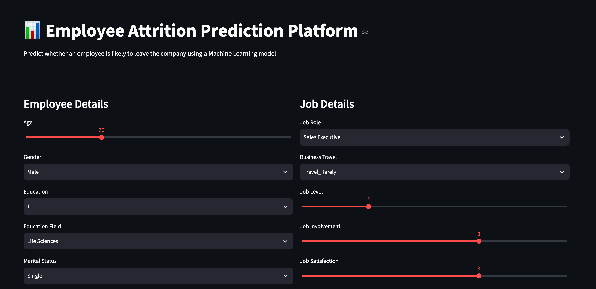

# 🚀 Employee Retention Prediction Platform

<p align="center">
  
  
  
  
</p>

---

## 📌 Overview

Employee attrition is one of the biggest challenges for organizations. Losing skilled employees increases hiring costs, decreases productivity, and impacts overall business performance.

This project predicts whether an employee is likely to leave the company based on various HR-related features such as job satisfaction, overtime, salary, working years, and more.

The project covers the **complete Machine Learning lifecycle**, from data preprocessing to model deployment.

---

# 🎯 Problem Statement

Given an employee's information, predict whether the employee will:

- ✅ Stay with the company
- ❌ Leave the company

This helps HR departments identify employees at risk and take preventive actions.

---

# 📊 Dataset

The dataset contains employee information including:

- Age
- Education
- Job Level
- Monthly Income
- Daily Rate
- Distance From Home
- Job Satisfaction
- Environment Satisfaction
- Overtime
- Stock Option Level
- Relationship Satisfaction
- Total Working Years
- Performance Rating
- Training Times Last Year
- And many more...

---

# ⚙️ Project Workflow

```text
Raw Dataset
      │
      ▼
Exploratory Data Analysis
      │
      ▼
Data Cleaning
      │
      ▼
Feature Engineering
      │
      ▼
Categorical Encoding
      │
      ▼
Feature Scaling
      │
      ▼
Train-Test Split
      │
      ▼
Logistic Regression
      │
      ▼
GridSearchCV
      │
      ▼
Model Evaluation
      │
      ▼
Pickle Model
      │
      ▼
Streamlit Deployment
```

---

# 📈 Model Performance

| Metric | Score |
|---------|-------|
| 🎯 Accuracy | **75%** |
| 🎯 Precision | **35%** |
| 🎯 Recall | **65%** |
| 🎯 F1 Score | **46%** |

---

# 🧠 Machine Learning Pipeline

### Data Preprocessing

- Missing Value Handling
- Categorical Feature Encoding
- Feature Scaling using StandardScaler
- Train-Test Split

### Exploratory Data Analysis

- Univariate Analysis
- Bivariate Analysis
- Correlation Heatmap
- Target Distribution
- Feature Relationships
- Statistical Summary

### Model

- Logistic Regression

### Hyperparameter Tuning

Performed using **GridSearchCV (5-Fold Cross Validation)**

Optimized Parameters:

- C
- Solver
- Penalty
- Class Weight

---

# 🛠️ Tech Stack

| Category | Technologies |
|----------|--------------|
| Language | Python |
| Data Analysis | Pandas, NumPy |
| Visualization | Matplotlib, Seaborn |
| Machine Learning | Scikit-Learn |
| Model Tuning | GridSearchCV |
| Deployment | Streamlit |
| Serialization | Pickle |

---

# 📂 Project Structure

```
Employee-Retention-Prediction
│
├── notebooks
│   ├── 01_EDA.ipynb
│   ├── 02_Preprocessing.ipynb
│   └── 03_Training.ipynb
│
├── model
│   ├── model.pkl
│   └── scaler.pkl
│
│──runtime.txt
│──.gitignore
├── app.py
├── requirements.txt
└── README.md
```

---

# 🚀 Installation

Clone the repository

```bash
git clone https://github.com/yourusername/Employee-Retention-Prediction.git
```

Move inside the folder

```bash
cd Employee-Retention-Prediction
```

Install dependencies

```bash
pip install -r requirements.txt
```

Run Streamlit

```bash
streamlit run app.py
```

---

# 📷 Application Preview



---

# 💡 Future Improvements

- Random Forest
- XGBoost
- LightGBM
- CatBoost
- SHAP Explainability
- Docker
- AWS Deployment
- Model Monitoring

---

# 👨‍💻 Author

**Sanskar Gupta**

B.Tech Data Science & Artificial Intelligence

Thapar Institute of Engineering & Technology

---

# ⭐ If you liked this project...

Give this repository a ⭐ on GitHub!

It motivates me to build more Machine Learning projects.
